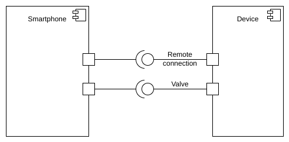
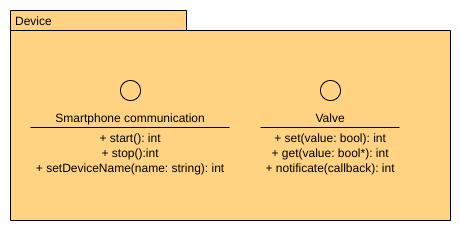

# Architecture

## Overall

The overall architecture as of an v1 is quite simple. It can be resumed as this:

## Device

Based on the above diagram we can deduce device API endpoints which need to be
developped:

